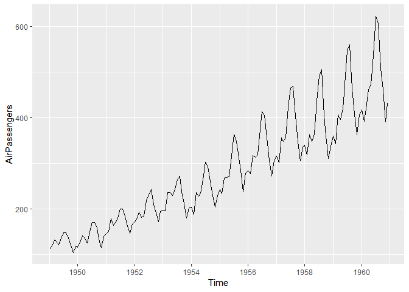
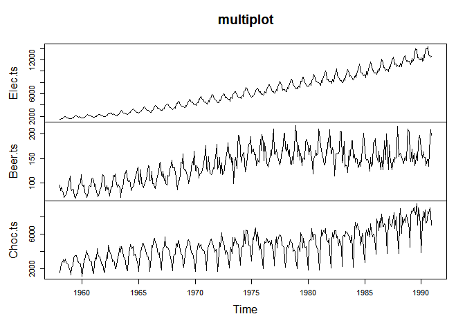
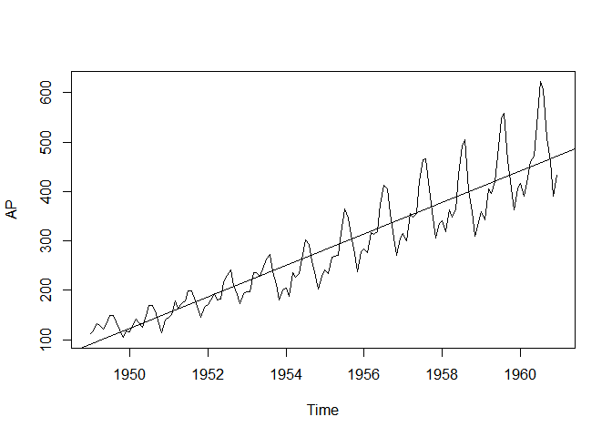
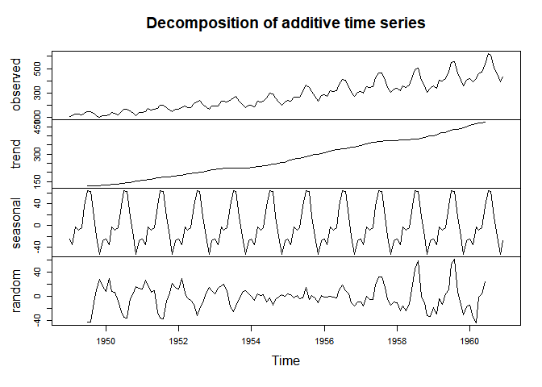

Time Series
================

``` r
library(ggfortify) #ggplot for timeseries data
```

``` r
library(forecast)
library(ggplot2)
```

## Plot Time-Series

  - Multi-Plot

``` r
autoplot(AirPassengers)
```

<!-- -->

``` r
CBE <- read.csv("C:/Rdata/tsDataSet/cbe.csv", header = T)
class(CBE)
## [1] "data.frame"
```

``` r
Choc.ts<-ts(CBE[,1], start = 1958, frequency = 12)
Beer.ts<-ts(CBE[,2], start = 1958, frequency = 12)
Elec.ts<-ts(CBE[,3], start = 1958, frequency = 12)

plot(cbind(Elec.ts, Beer.ts, Choc.ts), main = "multiplot")
```

<!-- -->

## Trend & Seasonality

### Trend-plot

``` r
AP<-AirPassengers

AP.time <- time(AP) # X-axis = time
Reg <- lm(AP~AP.time) #Linear Regression -> return 

plot(AP)
abline(Reg) # 자주 사용
```

<!-- -->

### Seasonality

Trend를 뺀 나머지 분포를 boxplot으로 본다.

## Decomposition

#### 1\. Trend

#### 2\. Original - Trend = Seasonality

#### 3\. Original - Trend - Seasonality = Noise, Error, Other…

``` r
decompose(AP)
```

    ## $x
    ##      Jan Feb Mar Apr May Jun Jul Aug Sep Oct Nov Dec
    ## 1949 112 118 132 129 121 135 148 148 136 119 104 118
    ## 1950 115 126 141 135 125 149 170 170 158 133 114 140
    ## 1951 145 150 178 163 172 178 199 199 184 162 146 166
    ## 1952 171 180 193 181 183 218 230 242 209 191 172 194
    ## 1953 196 196 236 235 229 243 264 272 237 211 180 201
    ## 1954 204 188 235 227 234 264 302 293 259 229 203 229
    ## 1955 242 233 267 269 270 315 364 347 312 274 237 278
    ## 1956 284 277 317 313 318 374 413 405 355 306 271 306
    ## 1957 315 301 356 348 355 422 465 467 404 347 305 336
    ## 1958 340 318 362 348 363 435 491 505 404 359 310 337
    ## 1959 360 342 406 396 420 472 548 559 463 407 362 405
    ## 1960 417 391 419 461 472 535 622 606 508 461 390 432
    ## 
    ## $seasonal
    ##             Jan        Feb        Mar        Apr        May        Jun
    ## 1949 -24.748737 -36.188131  -2.241162  -8.036616  -4.506313  35.402778
    ## 1950 -24.748737 -36.188131  -2.241162  -8.036616  -4.506313  35.402778
    ## 1951 -24.748737 -36.188131  -2.241162  -8.036616  -4.506313  35.402778
    ## 1952 -24.748737 -36.188131  -2.241162  -8.036616  -4.506313  35.402778
    ## 1953 -24.748737 -36.188131  -2.241162  -8.036616  -4.506313  35.402778
    ## 1954 -24.748737 -36.188131  -2.241162  -8.036616  -4.506313  35.402778
    ## 1955 -24.748737 -36.188131  -2.241162  -8.036616  -4.506313  35.402778
    ## 1956 -24.748737 -36.188131  -2.241162  -8.036616  -4.506313  35.402778
    ## 1957 -24.748737 -36.188131  -2.241162  -8.036616  -4.506313  35.402778
    ## 1958 -24.748737 -36.188131  -2.241162  -8.036616  -4.506313  35.402778
    ## 1959 -24.748737 -36.188131  -2.241162  -8.036616  -4.506313  35.402778
    ## 1960 -24.748737 -36.188131  -2.241162  -8.036616  -4.506313  35.402778
    ##             Jul        Aug        Sep        Oct        Nov        Dec
    ## 1949  63.830808  62.823232  16.520202 -20.642677 -53.593434 -28.619949
    ## 1950  63.830808  62.823232  16.520202 -20.642677 -53.593434 -28.619949
    ## 1951  63.830808  62.823232  16.520202 -20.642677 -53.593434 -28.619949
    ## 1952  63.830808  62.823232  16.520202 -20.642677 -53.593434 -28.619949
    ## 1953  63.830808  62.823232  16.520202 -20.642677 -53.593434 -28.619949
    ## 1954  63.830808  62.823232  16.520202 -20.642677 -53.593434 -28.619949
    ## 1955  63.830808  62.823232  16.520202 -20.642677 -53.593434 -28.619949
    ## 1956  63.830808  62.823232  16.520202 -20.642677 -53.593434 -28.619949
    ## 1957  63.830808  62.823232  16.520202 -20.642677 -53.593434 -28.619949
    ## 1958  63.830808  62.823232  16.520202 -20.642677 -53.593434 -28.619949
    ## 1959  63.830808  62.823232  16.520202 -20.642677 -53.593434 -28.619949
    ## 1960  63.830808  62.823232  16.520202 -20.642677 -53.593434 -28.619949
    ## 
    ## $trend
    ##           Jan      Feb      Mar      Apr      May      Jun      Jul
    ## 1949       NA       NA       NA       NA       NA       NA 126.7917
    ## 1950 131.2500 133.0833 134.9167 136.4167 137.4167 138.7500 140.9167
    ## 1951 157.1250 159.5417 161.8333 164.1250 166.6667 169.0833 171.2500
    ## 1952 183.1250 186.2083 189.0417 191.2917 193.5833 195.8333 198.0417
    ## 1953 215.8333 218.5000 220.9167 222.9167 224.0833 224.7083 225.3333
    ## 1954 228.0000 230.4583 232.2500 233.9167 235.6250 237.7500 240.5000
    ## 1955 261.8333 266.6667 271.1250 275.2083 278.5000 281.9583 285.7500
    ## 1956 309.9583 314.4167 318.6250 321.7500 324.5000 327.0833 329.5417
    ## 1957 348.2500 353.0000 357.6250 361.3750 364.5000 367.1667 369.4583
    ## 1958 375.2500 377.9167 379.5000 380.0000 380.7083 380.9583 381.8333
    ## 1959 402.5417 407.1667 411.8750 416.3333 420.5000 425.5000 430.7083
    ## 1960 456.3333 461.3750 465.2083 469.3333 472.7500 475.0417       NA
    ##           Aug      Sep      Oct      Nov      Dec
    ## 1949 127.2500 127.9583 128.5833 129.0000 129.7500
    ## 1950 143.1667 145.7083 148.4167 151.5417 154.7083
    ## 1951 173.5833 175.4583 176.8333 178.0417 180.1667
    ## 1952 199.7500 202.2083 206.2500 210.4167 213.3750
    ## 1953 225.3333 224.9583 224.5833 224.4583 225.5417
    ## 1954 243.9583 247.1667 250.2500 253.5000 257.1250
    ## 1955 289.3333 293.2500 297.1667 301.0000 305.4583
    ## 1956 331.8333 334.4583 337.5417 340.5417 344.0833
    ## 1957 371.2083 372.1667 372.4167 372.7500 373.6250
    ## 1958 383.6667 386.5000 390.3333 394.7083 398.6250
    ## 1959 435.1250 437.7083 440.9583 445.8333 450.6250
    ## 1960       NA       NA       NA       NA       NA
    ## 
    ## $random
    ##              Jan         Feb         Mar         Apr         May
    ## 1949          NA          NA          NA          NA          NA
    ## 1950   8.4987374  29.1047980   8.3244949   6.6199495  -7.9103535
    ## 1951  12.6237374  26.6464646  18.4078283   6.9116162   9.8396465
    ## 1952  12.6237374  29.9797980   6.1994949  -2.2550505  -6.0770202
    ## 1953   4.9154040  13.6881313  17.3244949  20.1199495   9.4229798
    ## 1954   0.7487374  -6.2702020   4.9911616   1.1199495   2.8813131
    ## 1955   4.9154040   2.5214646  -1.8838384   1.8282828  -3.9936869
    ## 1956  -1.2095960  -1.2285354   0.6161616  -0.7133838  -1.9936869
    ## 1957  -8.5012626 -15.8118687   0.6161616  -5.3383838  -4.9936869
    ## 1958 -10.5012626 -23.7285354 -15.2588384 -23.9633838 -13.2020202
    ## 1959 -17.7929293 -28.9785354  -3.6338384 -12.2967172   4.0063131
    ## 1960 -14.5845960 -34.1868687 -43.9671717  -0.2967172   3.7563131
    ##              Jun         Jul         Aug         Sep         Oct
    ## 1949          NA -42.6224747 -42.0732323  -8.4785354  11.0593434
    ## 1950 -25.1527778 -34.7474747 -35.9898990  -4.2285354   5.2260101
    ## 1951 -26.4861111 -36.0808081 -37.4065657  -7.9785354   5.8093434
    ## 1952 -13.2361111 -31.8724747 -20.5732323  -9.7285354   5.3926768
    ## 1953 -17.1111111 -25.1641414 -16.1565657  -4.4785354   7.0593434
    ## 1954  -9.1527778  -2.3308081 -13.7815657  -4.6868687  -0.6073232
    ## 1955  -2.3611111  14.4191919  -5.1565657   2.2297980  -2.5239899
    ## 1956  11.5138889  19.6275253  10.3434343   4.0214646 -10.8989899
    ## 1957  19.4305556  31.7108586  32.9684343  15.3131313  -4.7739899
    ## 1958  18.6388889  45.3358586  58.5101010   0.9797980 -10.6906566
    ## 1959  11.0972222  53.4608586  61.0517677   8.7714646 -13.3156566
    ## 1960  24.5555556          NA          NA          NA          NA
    ##              Nov         Dec
    ## 1949  28.5934343  16.8699495
    ## 1950  16.0517677  13.9116162
    ## 1951  21.5517677  14.4532828
    ## 1952  15.1767677   9.2449495
    ## 1953   9.1351010   4.0782828
    ## 1954   3.0934343   0.4949495
    ## 1955 -10.4065657   1.1616162
    ## 1956 -15.9482323  -9.4633838
    ## 1957 -14.1565657  -9.0050505
    ## 1958 -31.1148990 -33.0050505
    ## 1959 -30.2398990 -17.0050505
    ## 1960          NA          NA
    ## 
    ## $figure
    ##  [1] -24.748737 -36.188131  -2.241162  -8.036616  -4.506313  35.402778
    ##  [7]  63.830808  62.823232  16.520202 -20.642677 -53.593434 -28.619949
    ## 
    ## $type
    ## [1] "additive"
    ## 
    ## attr(,"class")
    ## [1] "decomposed.ts"

``` r
plot(decompose(AP))
```

<!-- -->
