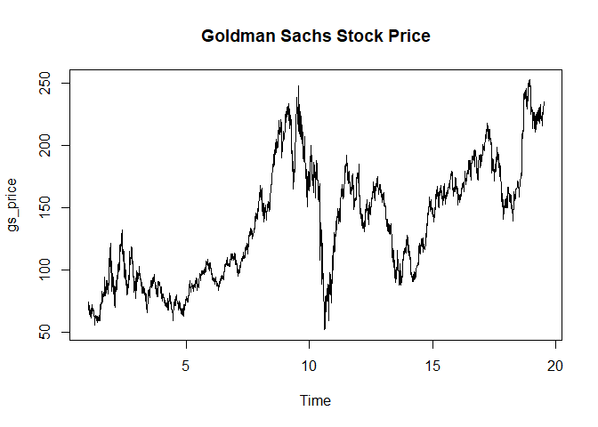
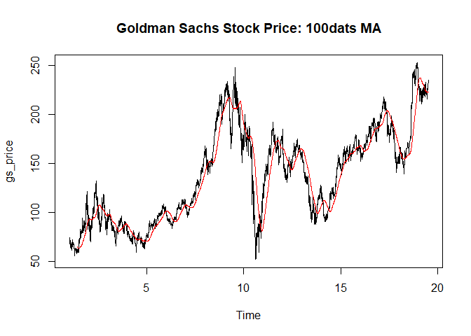

Moving Average
================

* Trend를 보기위해 사용
* 과거 일정시간을 평균낸다.
* s_t = [ x_t + x_t-1 + ... + x_t-k+1 ] / k
* s_t는 t에서의 이동평균값, k는 평균을 낼 간격을 의미한다. 
* 1/k 를 하나의 가중치로 보고 각각의 값에 곱해준다고 생각 할 수 있다.
``` r
head(gs)
```

    ##         date price   volume
    ## 1 1999-05-04 70.38 22320900
    ## 2 1999-05-05 69.13  7565700
    ## 3 1999-05-06 67.94  2905700
    ## 4 1999-05-07 74.13  4862300
    ## 5 1999-05-10 70.69  2589400
    ## 6 1999-05-11 70.63  1839800

### frequency

  - 주기는 임의로 준다. 주기가없으면 1
  - 평균 일주일에 5번 1년에 250일정도 된다.
  - (주의) TimeSeries를 만들때 dataframe의 한 column을 ts로 만들어야한다.

<!-- end list -->

``` r
gs_price <- ts(gs$price, frequency = 250)
# frequency
plot(gs_price, main = "Goldman Sachs Stock Price")
```

<!-- -->

### Moving Average

``` r
plot(gs_price, main = "Goldman Sachs Stock Price: 100dats MA")

# rep(1/100, 100)은 1/100의 가중치를 의미한다.
m1 <- filter(gs_price, rep(1/100, 100), sides=1)
# 겹치게 그리기
lines(m1,col = "red")
```

<!-- -->
