# ggplot


*Ctrl+Shift+Enter*. *Ctrl+Alt+I*. *Ctrl+Shift+K*

``` r
library(ggplot2)
```

    ## Registered S3 methods overwritten by 'ggplot2':
    ##   method         from 
    ##   [.quosures     rlang
    ##   c.quosures     rlang
    ##   print.quosures rlang

``` r
pressure<-datasets::pressure
ggplot(pressure, aes())
```

<!-- -->

``` r
# x축은 온도, y축은 압력으로 하고싶다.

ggplot(pressure, aes(x=temperature, y=pressure)) +
  geom_point(color='red') +
  # 선을 입히고 싶다.
  geom_line()
```

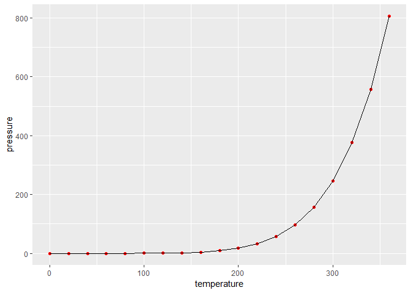<!-- -->

``` r
  # 색을 바꾸고 싶다.

ggplot(pressure, aes(x=temperature, y=pressure)) +
  # 선을 입히고 싶다.
  geom_line(size=2, color='deepskyblue') +
  # 색을 바꾸고 싶다.
  geom_point(size=2,color='red') +
  # 이름을 주고싶다.
  ggtitle('pressure data') +
  # x, y축에도 이름을 주고싶다.
  xlab('Temperature') +
  ylab('Pressure') +
  # 배경 테마를 바꾸고싶다.
  theme_bw()# theme_classic()  theme_grey()
```

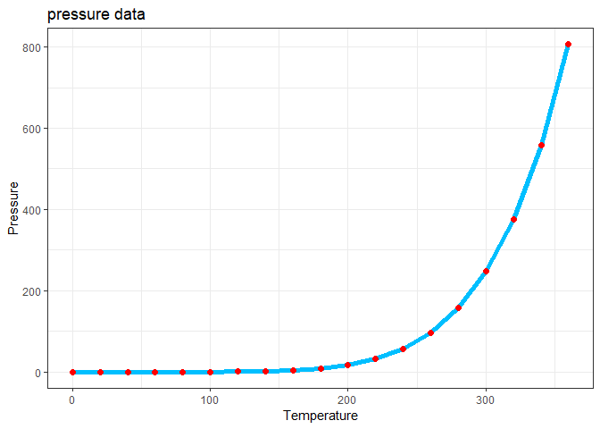<!-- -->

``` r
# 막대 그래프를 만들고싶다.

# 1. x축만 지정 -> 빈도
# 빈도수 막대그래프를 만들고싶다.
ggplot(diamonds, aes(cut))
```

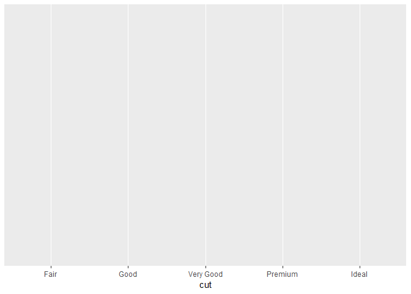<!-- -->

``` r
ggplot(diamonds, aes(cut)) +
  geom_bar()
```

<!-- -->

``` r
# default가 count이고 y축은 빈도수를 의미한다.
ggplot(diamonds, aes(cut)) +
  geom_bar(stat='count')
```

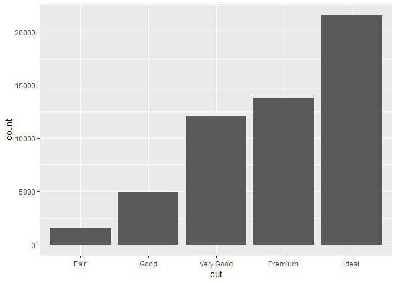<!-- -->

``` r
# 일반 막대 그래프를 만들고싶다.

#View(sleep)
# x,y를 길게쓰기 귀찮다.
ggplot(sleep, aes(ID, extra))
```

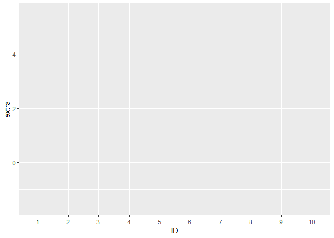<!-- -->

``` r
ggplot(sleep, aes(ID, extra)) +
  geom_bar(stat='identity') # statistc = 'identity' -> y축을 기반으로 만들겠다.
```

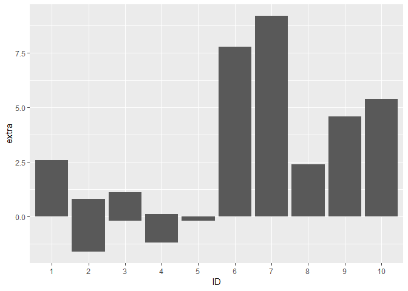<!-- -->

``` r
# ID별로 extra값이 합쳐진다. 

# 자동으로 합쳐지는 값들을 구분하고싶다.
ggplot(sleep, aes(ID, extra, fill=group)) +
  geom_bar(stat='identity')
```

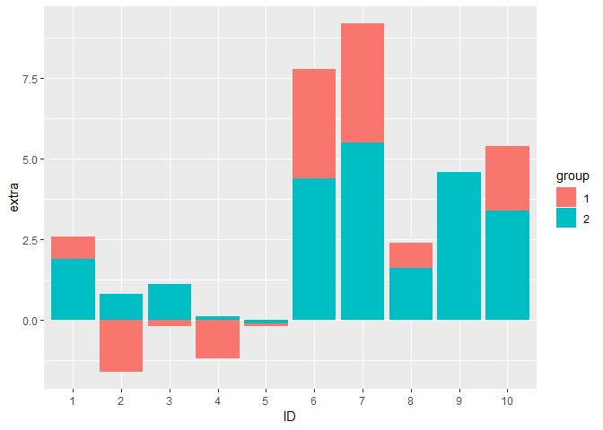<!-- -->

``` r
# 옆으로 떨어지게 해서 구분하고싶다.
ggplot(sleep, aes(ID, extra, fill=group)) +
  geom_bar(stat='identity', position="dodge")
```

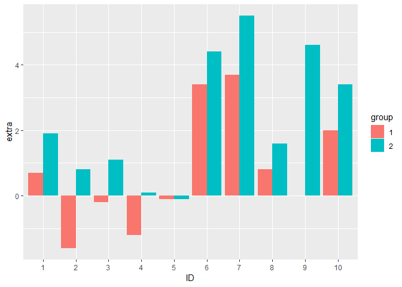<!-- -->

``` r
#View(diamonds)
```

``` r
# 빈도수를 출력하고, 그안에서 다른 기준으로 그룹을 구분하고싶다. 
ggplot(diamonds, aes(color, fill=cut)) +
  geom_bar()
```

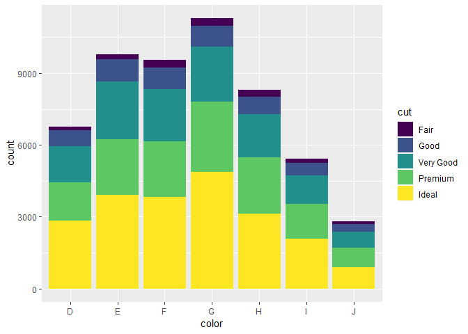<!-- -->

``` r
# 구분 한것에 대한 비율을 시각화 하고싶다.
ggplot(diamonds, aes(color, fill=cut)) +
  geom_bar(position="fill") 
```

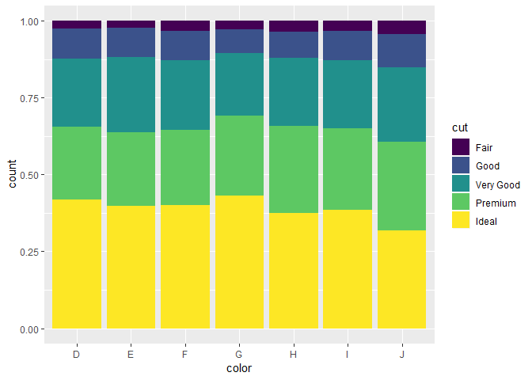<!-- -->

``` r
  # 색이 J이면 Fair 비율이 높다. 라는 것을 알 수 있다.

# 가로로 눕혀서 출력하고싶다.
# x축 이름이 너무 길어서 겹친다.
ggplot(diamonds, aes(color, fill=cut)) +
  geom_bar(position="fill") +
  coord_flip()
```

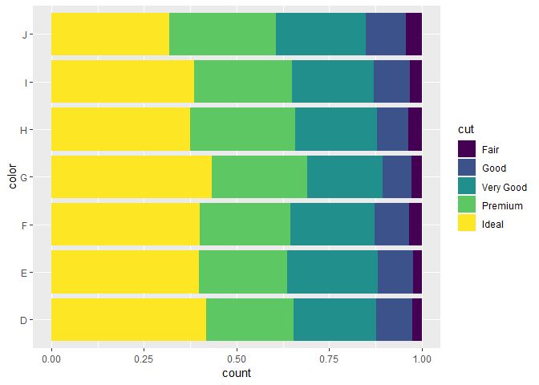<!-- -->

``` r
rWiki<-"R is a programming language and software environment for statistical computing and graphics supported by the R Foundation for Statistical Computing. The R language is widely used among statisticians and data miners for developing statistical software and data analysis. Polls, surveys of data miners, and studies of scholarly literature databases show that R's popularity has increased substantially in recent years.
R is a GNU package. The source code for the R software environment is written primarily in C, Fortran, and R. R is freely available under the GNU General Public License, and pre-compiled binary versions are provided for various operating systems. While R has a command line interface, there are several graphical front-ends available."


strsplit(rWiki, split="\n") -> rWikiPara

strsplit(rWikiPara[[1]], split="\\. ") -> rWikiSent

mysentences<-unlist(rWikiSent)
gregexpr("(stat)[[:alpha:]]+",tolower(mysentences)) ->
  mypattern
regmatches(tolower(mysentences), mypattern) -> my.alphas
table(unlist(my.alphas)) -> mytable

# dataFrame이 아닌 데이터를 그래프로 그리고 싶다.
mydata<-data.frame(mytable)
class(mydata)
```

    ## [1] "data.frame"

``` r
print(mydata)
```

    ##            Var1 Freq
    ## 1   statistical    3
    ## 2 statisticians    1

``` r
# 3 빈도수 그래프를 만들고 싶다.
ggplot(mydata, aes(x=Var1, y=Freq)) +
  geom_bar(stat='identity')
```

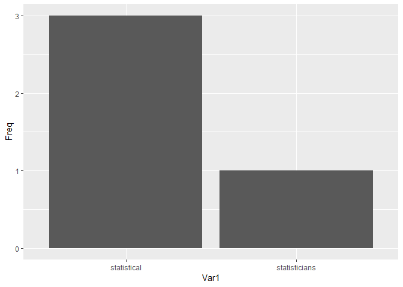<!-- -->

``` r
# 4 색을 채우고싶다.
ggplot(mydata, aes(x=Var1, y=Freq, fill=Var1)) +
  geom_bar(stat='identity')
```

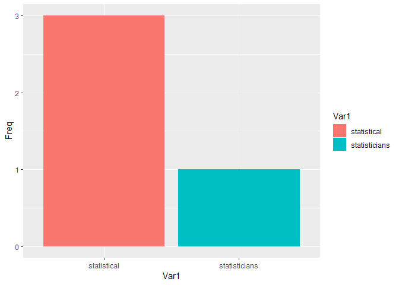<!-- -->

``` r
# 5 옆에 fill guide 범례를 없애고싶다.
ggplot(mydata, aes(x=Var1, y=Freq, fill=Var1)) +
  geom_bar(stat='identity') +
  guides(fill=FALSE)
```

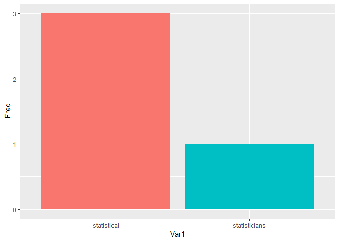<!-- -->

``` r
# 6 평균선을 긋고싶다. (특정 문자에 대한 빈도가 많은지 적은지를 확인하려고)
ggplot(mydata, aes(x=Var1, y=Freq, fill=Var1)) +
  geom_bar(stat='identity') +
  guides(fill=FALSE) +
  geom_hline(aes(yintercept=median(mytable))) # mytable Freq의 median에 horizontal line을 그린다. 
```

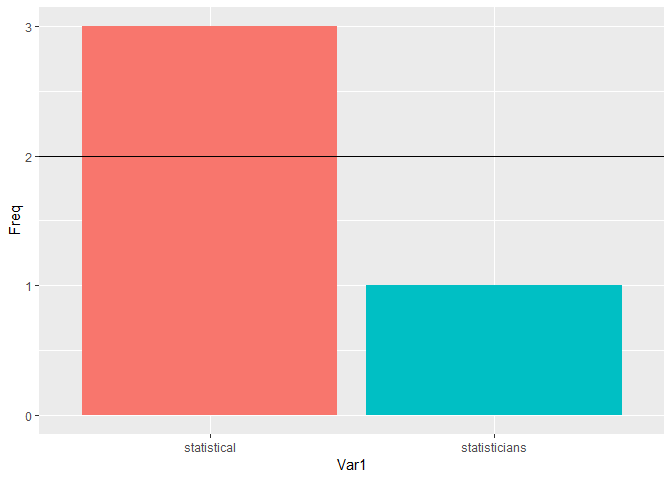<!-- -->

``` r
# 어떤 데이터에서 특정 값을 가진 row 를 보고싶다.
mpg[mpg$class == "suv",] #1
```

    ## # A tibble: 62 x 11
    ##    manufacturer model displ  year   cyl trans drv     cty   hwy fl    class
    ##    <chr>        <chr> <dbl> <int> <int> <chr> <chr> <int> <int> <chr> <chr>
    ##  1 chevrolet    c150~   5.3  2008     8 auto~ r        14    20 r     suv  
    ##  2 chevrolet    c150~   5.3  2008     8 auto~ r        11    15 e     suv  
    ##  3 chevrolet    c150~   5.3  2008     8 auto~ r        14    20 r     suv  
    ##  4 chevrolet    c150~   5.7  1999     8 auto~ r        13    17 r     suv  
    ##  5 chevrolet    c150~   6    2008     8 auto~ r        12    17 r     suv  
    ##  6 chevrolet    k150~   5.3  2008     8 auto~ 4        14    19 r     suv  
    ##  7 chevrolet    k150~   5.3  2008     8 auto~ 4        11    14 e     suv  
    ##  8 chevrolet    k150~   5.7  1999     8 auto~ 4        11    15 r     suv  
    ##  9 chevrolet    k150~   6.5  1999     8 auto~ 4        14    17 d     suv  
    ## 10 dodge        dura~   3.9  1999     6 auto~ 4        13    17 r     suv  
    ## # ... with 52 more rows

``` r
mpg[mpg$class == "suv", c('cty', 'manufacturer')] #2
```

    ## # A tibble: 62 x 2
    ##      cty manufacturer
    ##    <int> <chr>       
    ##  1    14 chevrolet   
    ##  2    11 chevrolet   
    ##  3    14 chevrolet   
    ##  4    13 chevrolet   
    ##  5    12 chevrolet   
    ##  6    14 chevrolet   
    ##  7    11 chevrolet   
    ##  8    11 chevrolet   
    ##  9    14 chevrolet   
    ## 10    13 dodge       
    ## # ... with 52 more rows

``` r
mpg[mpg$class == "suv", c('cty', 'manufacturer')] -> mpg.suv

# 어떤 데이터에 대해서 어떤 값을 기준으로 어떤 연산을 진행
aggregate(cty~manufacturer, mpg.suv, mean)
```

    ##    manufacturer      cty
    ## 1     chevrolet 12.66667
    ## 2         dodge 11.85714
    ## 3          ford 12.88889
    ## 4          jeep 13.50000
    ## 5    land rover 11.50000
    ## 6       lincoln 11.33333
    ## 7       mercury 13.25000
    ## 8        nissan 13.75000
    ## 9        subaru 18.83333
    ## 10       toyota 14.37500

``` r
aggregate(cty~manufacturer, mpg.suv, mean) -> res

# 정렬된 인덱스를 얻고싶다.
order(res$cty) #4
```

    ##  [1]  6  5  2  1  3  7  4  8 10  9

``` r
# 정렬된 인덱스를 이용해 조회를 하고싶다. 
res[order(res$cty),] #5
```

    ##    manufacturer      cty
    ## 6       lincoln 11.33333
    ## 5    land rover 11.50000
    ## 2         dodge 11.85714
    ## 1     chevrolet 12.66667
    ## 3          ford 12.88889
    ## 7       mercury 13.25000
    ## 4          jeep 13.50000
    ## 8        nissan 13.75000
    ## 10       toyota 14.37500
    ## 9        subaru 18.83333

``` r
# 내림차순으로 하고싶다.
res[order(res$cty, decreasing = T),] #6
```

    ##    manufacturer      cty
    ## 9        subaru 18.83333
    ## 10       toyota 14.37500
    ## 8        nissan 13.75000
    ## 4          jeep 13.50000
    ## 7       mercury 13.25000
    ## 3          ford 12.88889
    ## 1     chevrolet 12.66667
    ## 2         dodge 11.85714
    ## 5    land rover 11.50000
    ## 6       lincoln 11.33333

``` r
head(res[order(res$cty, decreasing = T),])->res
ggplot(res, aes(x=manufacturer, y=cty)) +
  geom_col() #7
```

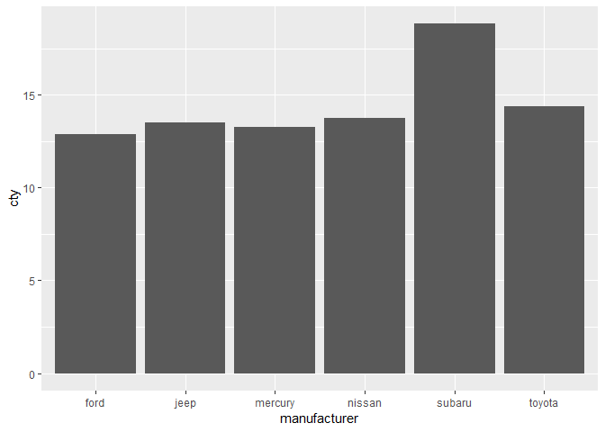<!-- -->

``` r
# bar와 col의 차이. 는 빈도수
ggplot(data=mpg, aes(x=class)) +
  geom_bar()
```

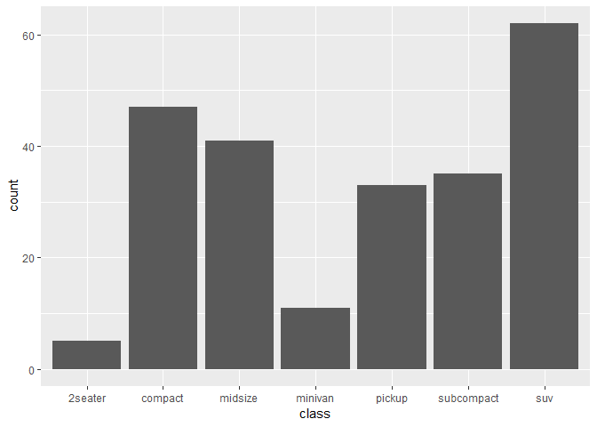<!-- -->
