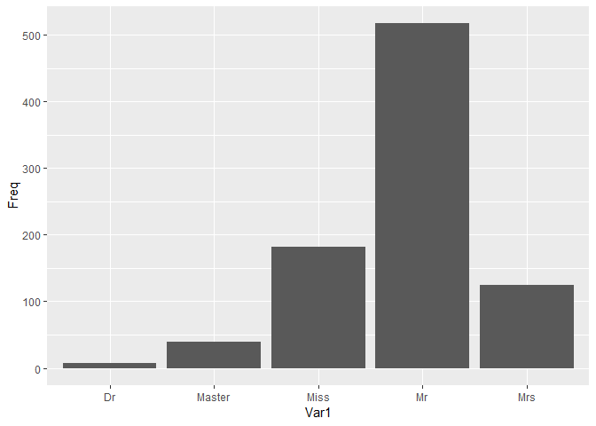

Term Frequency Inverse Document Frequency
================
## 과정 
1. Corpus 전처리
2. TDM - Term Document Matrix
3. TFIDF

## 1. 전처리
### 1-1. 공백 처리하기
``` r
#각각 " ", "  ", "\t"으로 구분된다.
mytext<-c("software environment",
  "software  environment",
  "software\tenvironment")
mytext
```

    ## [1] "software environment"  "software  environment" "software\tenvironment"


``` r
str_replace_all(mytext,"[[:space:]]{1,}", " ")->mt2
sapply(mt2, length)
```

    ## software environment software environment software environment 
    ##                    1                    1                    1

``` r

sapply(mt2, str_length)
```

    ## software environment software environment software environment 
    ##                   20                   20                   20

### 1-2. extract_all에 boundary 옵션으로 특수문자 처리

``` r
mytext<-"The 45th President of the United States, Donald Trump, states that he knows how to play trump with the former president"

str_extract_all(mytext, boundary("word"))
```

    ## [[1]]
    ##  [1] "The"       "45th"      "President" "of"        "the"      
    ##  [6] "United"    "States"    "Donald"    "Trump"     "states"   
    ## [11] "that"      "he"        "knows"     "how"       "to"       
    ## [16] "play"      "trump"     "with"      "the"       "former"   
    ## [21] "president"

``` r
myword<-unlist(str_extract_all(mytext, boundary("word")))
myword
```

    ##  [1] "The"       "45th"      "President" "of"        "the"      
    ##  [6] "United"    "States"    "Donald"    "Trump"     "states"   
    ## [11] "that"      "he"        "knows"     "how"       "to"       
    ## [16] "play"      "trump"     "with"      "the"       "former"   
    ## [21] "president"

``` r
myword<-str_replace(myword,"Trump", "Trump_unique_")
myword<-str_replace(myword,"States", "States_unique_")
tolower(myword)
```

    ##  [1] "the"            "45th"           "president"      "of"            
    ##  [5] "the"            "united"         "states_unique_" "donald"        
    ##  [9] "trump_unique_"  "states"         "that"           "he"            
    ## [13] "knows"          "how"            "to"             "play"          
    ## [17] "trump"          "with"           "the"            "former"        
    ## [21] "president"

### 1-3. 숫자 처리하기

``` r
# 구분 될 필요가 있는 숫자

mytext<-c("He is one of statisticians agreeing that R is the No. 1 statistical software.","He is one of statisticians agreeing that R is the No. one statistical software.")
str_split(mytext," ")
```

    ## [[1]]
         
    ##  [9] "is"            "the"           "No."           "1"            
    ## [13] "statistical"   "software."    
    ## 
    ## [[2]]
    ##  [1] "He"            "is"            "one"           "of"                   
    ##  [9] "is"            "the"           "No."           "one"       
``` r
str_replace_all(mytext, "[[:digit:]]{1,}[[:space:]]{1,}", "") -> mytext2
str_split(mytext2, " ")->mytext2
mytext2
```

    ## [[1]]
    ##  [1] "He"            "is"            "one"           "of"           
    ##  [5] "statisticians" "agreeing"      "that"          "R"            
    ##  [9] "is"            "the"           "No."           "statistical"  
    ## [13] "software."    
    ## 
    ## [[2]]
    ##  [1] "He"            "is"            "one"           "of"           
    ##  [5] "statisticians" "agreeing"      "that"          "R"            
    ##  [9] "is"            "the"           "No."           "one"          
    ## [13] "statistical"   "software."

``` r
str_c(mytext2[[1]], collapse = " ")
```

    ## [1] "He is one of statisticians agreeing that R is the No. statistical software."

``` r
str_c(mytext2[[2]], collapse = " ")
```

    ## [1] "He is one of statisticians agreeing that R is the No. one statistical software."

``` r
# 숫자 처리 
mytext3<-str_replace_all(mytext, "[[:digit:]]{1,}", "_number_")
mytext3
```

    ## [1] "He is one of statisticians agreeing that R is the No. _number_ statistical software."
    ## [2] "He is one of statisticians agreeing that R is the No. one statistical software."

``` r
mytext3<-str_split(mytext3, " ")
mytext3
```

    ## [[1]]
    ##  [1] "He"            "is"            "one"           "of"           
    ##  [5] "statisticians" "agreeing"      "that"          "R"            
    ##  [9] "is"            "the"           "No."           "_number_"     
    ## [13] "statistical"   "software."    
    ## 
    ## [[2]]
    ##  [1] "He"            "is"            "one"           "of"           
    ##  [5] "statisticians" "agreeing"      "that"          "R"            
    ##  [9] "is"            "the"           "No."           "one"          
    ## [13] "statistical"   "software."

### 1-4. 특수문자, 불용어 처리하기

``` r
# 구분 될 필요가 있는 특수문자 
mytext<-"Baek et al. (2014) argued that the state of default-setting is critical for people to protect their own personal privacy on the Internet." # Baek et al = Baek 외에 여러명

#str_split(mytext, "\\.")

# "성씨 다음 et al.이 오고, 이어서(년도)형식
# => "_reference_"로 일괄 치환
# 하이픈 기호 

# 1. 하이픈
mytext2<-str_replace_all(mytext, "-", " ")
mytext2<-str_replace_all(mytext2,"[[:upper:]]{1}[[:alpha:]]{1,}[[:space:]]{1}(et al\\.)[[:space:]]{1}\\([[:digit:]]{4}\\)","_reference_")
mytext2
```

    ## [1] "_reference_ argued that the state of default setting is critical for people to protect their own personal privacy on the Internet."

``` r
# 2. . 공백 제거
mytext2<-str_replace_all(mytext2,"\\.[[:space:]]{0,}","")
mytext2
```

    ## [1] "_reference_ argued that the state of default setting is critical for people to protect their own personal privacy on the Internet"

``` r
# 3. 불용어 직접 등록, 제거
mystopwords<- "(\\ba )|(\\ban )|(\\bthe )"

mytext<-c("she is an actor", "She is the actor")
str_replace_all(mytext, mystopwords,"")
```

    ## [1] "she is actor" "She is actor"

``` r
# 4. 정의되어있는 불용어 사용하기
# stopwords("en") # 짧은 불용어
# stopwords("SMART") # 긴 불용어

# 어근 동일화 처리
# 시제 고려 -> 동일화
# ~s ~es -> 동일화
```

### 1-5. 불용어 처리 함수

``` r
mystemmer.func<-function(mytext){
  mytext<-str_replace_all(mytext, "(\\bam )|(\\bare )|(\\bas )|(\\bwas )|(\\bwere )|(\\bbe)", "be ")
print(mytext)
}

test<-c("i am a boy. You are a boy. He mitght be a boy")

mystemmer.func(test)
```

    ## [1] "i be a boy. You be a boy. He mitght be  a boy"

## 1-6.  n-gram

``` r
# n-gram : 1-gram(의미없음)
#          2-gram(bi-gram), 3-gram(tri-gram)
# n번 연이어 등장하는 단어들의 연결
# 등장배경 : 문장에 대해 이해하기 위해서
# 단어 분리시 문장에 대한 의미가 어려워진다.
# n gram + bayes => 문맥파악

"The United States comprises fifty states. In the United States, each state has its own laws. However, federal law overrides state law in the United States." -> mytext

# extract로 split보다 깔끔하게 분리 가능하다. 
str_extract_all(mytext, boundary(type="word"))
```

    ## [[1]]
    ##  [1] "The"       "United"    "States"    "comprises" "fifty"    
    ##  [6] "states"    "In"        "the"       "United"    "States"   
    ## [11] "each"      "state"     "has"       "its"       "own"      
    ## [16] "laws"      "However"   "federal"   "law"       "overrides"
    ## [21] "state"     "law"       "in"        "the"       "United"   
    ## [26] "States"

``` r
str_extract_all(mytext, boundary(type="word")) -> myword

# 등장한 단어의 빈도수
table(myword)
```

    ## myword
    ## comprises      each   federal     fifty       has   However        in 
    ##         1         1         1         1         1         1         1 
    ##        In       its       law      laws overrides       own     state 
    ##         1         1         2         1         1         1         2 
    ##    states    States       the       The    United 
    ##         1         3         2         1         3

``` r
# 모든 단어의 갯수
sum(table(myword))
```

    ## [1] 26

``` r
# 서로 다른 단어의 개수
length(table(myword))
```

    ## [1] 19

``` r
# 위처럼 나누면 united의 states와 동사 states 구분이 안된다.
# 따라서 고유명사는 전처리 할 필요가 있다.

str_replace_all(mytext, "\\bUnited States", "United_States")
```

    ## [1] "The United_States comprises fifty states. In the United_States, each state has its own laws. However, federal law overrides state law in the United_States."

``` r
str_replace_all(mytext, "\\bUnited States", "United_States")->mytext.2gram
str_extract_all(mytext.2gram, boundary(type="word"))
```

    ## [[1]]
    ##  [1] "The"           "United_States" "comprises"     "fifty"        
    ##  [5] "states"        "In"            "the"           "United_States"
    ##  [9] "each"          "state"         "has"           "its"          
    ## [13] "own"           "laws"          "However"       "federal"      
    ## [17] "law"           "overrides"     "state"         "law"          
    ## [21] "in"            "the"           "United_States"

#### 2. Corpus 처리

  - Corpus 읽기 text 파일들을 읽어온다

<!-- end list -->

``` r
# library(tm)
my.text.location<-"C:/rwork/Data/papers/papers/"
my.text.location
```

    ## [1] "C:/rwork/Data/papers/papers/"

``` r
# tm(text mining) 패키지 이용

# txt파일을 모두 합쳐서 Corpus로 만든다.
VCorpus(DirSource(my.text.location))
```

    ## <<VCorpus>>
    ## Metadata:  corpus specific: 0, document level (indexed): 0
    ## Content:  documents: 24

``` r
VCorpus(DirSource(my.text.location))->mypaper
class(unlist(mypaper))
```

    ## [1] "character"

  - Corpus 정보 확인

<!-- end list -->

``` r
class(mypaper)
```

    ## [1] "VCorpus" "Corpus"

``` r
summary(mypaper)
```

    ##            Length Class             Mode
    ## p2009a.txt 2      PlainTextDocument list
    ## p2009b.txt 2      PlainTextDocument list
    ## p2010a.txt 2      PlainTextDocument list
    ## p2010b.txt 2      PlainTextDocument list
    ## p2010c.txt 2      PlainTextDocument list
    ## p2011a.txt 2      PlainTextDocument list
    ## p2011b.txt 2      PlainTextDocument list
    ## p2012a.txt 2      PlainTextDocument list
    ## p2012b.txt 2      PlainTextDocument list
    ## p2013a.txt 2      PlainTextDocument list
    ## p2014a.txt 2      PlainTextDocument list
    ## p2014b.txt 2      PlainTextDocument list
    ## p2014c.txt 2      PlainTextDocument list
    ## p2014d.txt 2      PlainTextDocument list
    ## p2014e.txt 2      PlainTextDocument list
    ## p2014f.txt 2      PlainTextDocument list
    ## p2014g.txt 2      PlainTextDocument list
    ## p2014h.txt 2      PlainTextDocument list
    ## p2014i.txt 2      PlainTextDocument list
    ## p2014k.txt 2      PlainTextDocument list
    ## p2015a.txt 2      PlainTextDocument list
    ## p2015b.txt 2      PlainTextDocument list
    ## p2015c.txt 2      PlainTextDocument list
    ## p2015d.txt 2      PlainTextDocument list

  - #### 한개의 txt문서에 대한 정보 확인

<!-- end list -->

``` r
mypaper[[2]]$meta
```

    ##   author       : character(0)
    ##   datetimestamp: 2019-05-24 08:40:31
    ##   description  : character(0)
    ##   heading      : character(0)
    ##   id           : p2009b.txt
    ##   language     : en
    ##   origin       : character(0)

  - #### 메타데이터에 새로운 값 입력

<!-- end list -->

``` r
meta(mypaper[[2]], tag='author')<-"G. D. Hong"
mypaper[[2]]$meta
```

    ##   author       : G. D. Hong
    ##   datetimestamp: 2019-05-24 08:40:31
    ##   description  : character(0)
    ##   heading      : character(0)
    ##   id           : p2009b.txt
    ##   language     : en
    ##   origin       : character(0)

  - #### 분석을 위해 리스트를 풀어주기

<!-- end list -->

``` r
unlist(mypaper)->mypaper
```

  - #### 단어+특수문자+단어 조합을 가진 것 추출

<!-- end list -->

``` r
myfunc<-function(x){
  str_extract_all(x,"[[:alnum:]]{1,}[[:punct:]]{1,}[[:alnum:]]{1,}")
  # alnum : letters, numbers // punct : .!?,;
  # str_extract_all(데이터, 추출할 문자열이나 정규표현식) 
}

lapply(mypaper, myfunc) -> mypuncts

unlist(mypuncts)
```

    ##               content.content1               content.content2 
    ##                      "face-to"                      "face-to" 
    ##               content.content3 content.meta.datetimestamp.sec 
    ##               "within-subject"             "31.7814059257507" 
    ##                content.meta.id                content.content 
    ##                   "p2009a.txt"                "meta-analysis" 
    ## content.meta.datetimestamp.sec                content.meta.id 
    ##             "31.7814059257507"                   "p2009b.txt" 
    ##               content.content1               content.content2 


  - #### 수치로된 자료를 추출

<!-- end list -->

``` r
myfunc2<-function(x){
  str_extract_all(x,"[[:digit:]]{1,}")
}

lapply(mypaper, myfunc2) -> mydigits

table(unlist(mydigits))
```

    ## 
    ##             0             1            11           119           143 
    ##            24             9             1            24            24 
    ##          1973             2          2002          2003          2004 

  - #### 대문자로 시작하는 단어 추출(고유명사)

<!-- end list -->

``` r
myfunc3<-function(charVector){
  str_extract_all(charVector, "\\b[[:upper:]]{1,}[[:alpha:]]{0,}")
}

lapply(mypaper, myfunc3) -> my.uppers2

#table(unlist(my.uppers2))
```

  - 어근 추출 함수 / tm\_map <https://thebook.io/006723/ch10/07/02/>
    <https://studymaps.tistory.com/18>

<!-- end list -->

``` r
VCorpus(DirSource(my.text.location))->mypaper
tm_map(mypaper, removeNumbers) -> mycorpus
mycorpus[[1]]$content
```

    ## [1] "Does deliberative setting, online versus face-to-face, influence citizens' experiences? Are certain factors differently influential in one setting than in the other? We draw on a nationally representative survey and identify citizens who participated in both online and face-to-face settings (n = ). We use structural equation modeling to first assess the effects that deliberation format has on the interrelationship between such crucial factors as motivations to deliberate, perceived diversity, elicited emotions, enhanced understanding, and goal evaluation. We later employ network analysis to ask which factor or which cluster of factors is more central to an overall experience in which format. Relying on citizens who participated in both settings and using within-subject analyses, we assure that the previously unnoted findings are attributable to the format per se rather than to individual characteristics. We discuss the theoretical, practical and methodological implications."

``` r
removePunctuation("hello......world")
```

    ## [1] "helloworld"
    
### 어근 추출 함수

``` r
# library(SnowballC)

# 어근 추출 함수 -> 담주 프로젝트에서 쓰면 유용
wordStem(c("learn", "learns", "learning", "learned"))
```

    ## [1] "learn" "learn" "learn" "learn"

``` r
print(mypaper[[1]]$content)
```

    ## [1] "Does deliberative setting, online versus face-to-face, influence citizens' experiences? Are certain factors differently influential in one setting than in the other? We draw on a nationally representative survey and identify citizens who participated in both online and face-to-face settings (n = 82). We use structural equation modeling to first assess the effects that deliberation format has on the interrelationship between such crucial factors as motivations to deliberate, perceived diversity, elicited emotions, enhanced understanding, and goal evaluation. We later employ network analysis to ask which factor or which cluster of factors is more central to an overall experience in which format. Relying on citizens who participated in both settings and using within-subject analyses, we assure that the previously unnoted findings are attributable to the format per se rather than to individual characteristics. We discuss the theoretical, practical and methodological implications."

``` r
print('추출 후 ')
```

    ## [1] "추출 후 "

``` r
cleaned<-tm_map(mypaper, stemDocument)
cleaned[[1]]$content
```

    ## [1] "Doe delib setting, onlin versus face-to-face, influenc citizen experiences? Are certain factor differ influenti in one set than in the other? We draw on a nation repres survey and identifi citizen who particip in both onlin and face-to-fac set (n = 82). We use structur equat model to first assess the effect that deliber format has on the interrelationship between such crucial factor as motiv to deliberate, perceiv diversity, elicit emotions, enhanc understanding, and goal evaluation. We later employ network analysi to ask which factor or which cluster of factor is more central to an overal experi in which format. Reli on citizen who particip in both set and use within-subject analyses, we assur that the previous unnot find are attribut to the format per se rather than to individu characteristics. We discuss the theoretical, practic and methodolog implications."

  - 문자열 전처리 코드

<!-- end list -->

``` r
mycorpus<-tm_map(mypaper,removeNumbers) # mypaper corpus 에서 numbers 제거

mytempfunc<-function(myobject,oldexp,newexp){
  tm_map(myobject, 
         content_transformer(function(x,pattern) gsub(pattern, newexp, x)), # pattern<-oldexp
         oldexp) -> newobject
  #print(newobject)
}


mycorpus <- mytempfunc(mycorpus,"-collar","collar")
mycorpus <- mytempfunc(mycorpus,"\\b((c|C)o-)","co")
mycorpus <- mytempfunc(mycorpus,"\\b((c|C)ross-)","cross")
mycorpus <- mytempfunc(mycorpus,"e\\.g\\.","for example")
mycorpus <- mytempfunc(mycorpus,"i\\.e\\.","that is")
mycorpus <- mytempfunc(mycorpus,"\\'s","")
mycorpus <- mytempfunc(mycorpus,"s’","s")
mycorpus <- mytempfunc(mycorpus,"ICD-","ICD")
mycorpus <- mytempfunc(mycorpus,"\\b((i|I)nter-)","inter")
mycorpus <- mytempfunc(mycorpus,"K-pop","Kpop")
mycorpus <- mytempfunc(mycorpus,"\\b((m|M)eta-)","meta")
mycorpus <- mytempfunc(mycorpus,"\\b((o|O)pt-)","opt")
mycorpus <- mytempfunc(mycorpus,"\\b((p|P)ost-)","post")
mycorpus <- mytempfunc(mycorpus,"-end","end")
mycorpus <- mytempfunc(mycorpus,"\\b((w|W)ithin-)","within")
mycorpus <- mytempfunc(mycorpus,"=","is equal to")
mycorpus <- mytempfunc(mycorpus,"and/or","and or")
mycorpus <- mytempfunc(mycorpus,"his/her","his her")
mycorpus <- mytempfunc(mycorpus,"-"," ")

mycorpus[[1]]$content
```

    ## [1] "Does deliberative setting, online versus face to face, influence citizens' experiences? Are certain factors differently influential in one setting than in the other? We draw on a nationally representative survey and identify citizens who participated in both online and face to face settings (n is equal to ). We use structural equation modeling to first assess the effects that deliberation format has on the interrelationship between such crucial factors as motivations to deliberate, perceived diversity, elicited emotions, enhanced understanding, and goal evaluation. We later employ network analysis to ask which factor or which cluster of factors is more central to an overall experience in which format. Relying on citizens who participated in both settings and using withinsubject analyses, we assure that the previously unnoted findings are attributable to the format per se rather than to individual characteristics. We discuss the theoretical, practical and methodological implications."

``` r
# (n = )이 (n is equal to )로 바뀜
```

#### 불필요한 공백 제거

``` r
tm_map(mycorpus, stripWhitespace)
```

    ## <<VCorpus>>
    ## Metadata:  corpus specific: 0, document level (indexed): 0
    ## Content:  documents: 24

  - 대소문자 -\> 소문자로 치환

<!-- end list -->

``` r
mycorpus <- tm_map(mycorpus, content_transformer(tolower))
mycorpus[[2]]$content
```

    ## [1] "the debate on late night comedy has been inconclusive, with some scholars arguing that this genre increases political knowledge, and others seeing late night comedy as harmful to effective citizenry. we add to the debate and to the research on media effects more generally, by proposing a model that measures political knowledge. the model utilizes item response theory (irt) to account for individual characteristics, knowledge item difficulty, and response format that influences the likelihood of providing a correct response. drawing on the  national annenberg election study, we employ this model to test knowledge gain from late night comedy. using a metaanalysis across  political knowledge items, we show that late night comedy increases knowledge, but primarily on easy political items that have fewer correct response options, and mainly among the inattentive citizens. we discuss theoretical implications and provide practical suggestions for scholarship on media effects."

``` r
tm_map(mycorpus, removeWords, words = stopwords("SMART"))
```

    ## <<VCorpus>>
    ## Metadata:  corpus specific: 0, document level (indexed): 0
    ## Content:  documents: 24

``` r
mycorpus<-tm_map(mycorpus, stemDocument, language="en")
```

### tf-idf

#### \* DTM (Document(행) Term(열) Matrix) or TDM

``` r
# tf-idf 
mycorpus[[1]]$content
```

    ## [1] "doe delib setting, onlin versus face to face, influenc citizen experiences? are certain factor differ influenti in one set than in the other? we draw on a nation repres survey and identifi citizen who particip in both onlin and face to face set (n is equal to ). we use 

## TDM
``` r
dtm.e<-DocumentTermMatrix(mycorpus)
inspect(dtm.e[5:15,10:20])
```

    ## <<DocumentTermMatrix (documents: 11, terms: 11)>>
    ## Non-/sparse entries: 8/113
    ## Sparsity           : 93%
    ## Maximal term length: 10
    ## Weighting          : term frequency (tf)
    ## Sample             :
    ##             Terms
    ## Docs         (for (irt) (isps) (meps) (operation (sem) (sna) (sns) (snss),
    ##   p2010c.txt    0     0      0      0          0     0     0     0       0
    ##   p2011a.txt    0     0      0      0          0     0     0     0       0
    ##   p2011b.txt    0     0      0      0          0     0     0     0       0
    ##   p2012a.txt    0     0      0      0          0     0     0     0       0
    ##   p2012b.txt    1     0      0      0          0     0     0     0       0
    ##   p2013a.txt    1     0      0      0          0     0     0     0       1
    ##   p2014a.txt    0     0      0      0          0     0     0     0       0
    ##   p2014c.txt    0     0      0      1          0     1     0     0       0
    ##   p2014d.txt    1     0      0      0          0     0     0     0       0
    ##   p2014e.txt    0     0      0      0          0     0     0     1       0
    ##             Terms
    ## Docs         (that
    ##   p2010c.txt     0
    ##   p2011a.txt     0
    ##   p2011b.txt     0
    ##   p2012a.txt     0
    ##   p2012b.txt     0
    ##   p2013a.txt     0
    ##   p2014a.txt     2
    ##   p2014c.txt     0
    ##   p2014d.txt     0
    ##   p2014e.txt     0

``` r
# sparsity -> 나온단어/전체단어

```

## 연습문제

#### 1\. 캐글 타이타닉 데이터 중, train.csv파일에 있는 Name 컬럼에서 호칭을 추출한 후, 범주형으로 치환하시오.(가장 많이 등장한 상위 5개의 호칭만 치환할 것)

``` r
path = "C:/rwork/Data/titanic_train.csv"
ttn<-read.csv(path)
class(ttn$Name)
```

    ## [1] "factor"

``` r
#str_extract_all(ttn$Name,"[[:space:]]{1}(M)[[:alpha:]]{1,}\\",simplify = T)

ttn$sirName<-str_extract_all(ttn$Name,"(\\,)[[:space:]]{1}[[:alpha:]]{1,}(\\.)[[:space:]]{1}",simplify = T)
ttn$sirName<-str_extract_all(ttn$sirName,"[[:alpha:]]{1,}", simplify = T)
head(ttn[c("Name","sirName")])
```

    ##                                                  Name sirName
    ## 1                             Braund, Mr. Owen Harris      Mr
    ## 2 Cumings, Mrs. John Bradley (Florence Briggs Thayer)     Mrs
    ## 3                              Heikkinen, Miss. Laina    Miss
    ## 4        Futrelle, Mrs. Jacques Heath (Lily May Peel)     Mrs
    ## 5                            Allen, Mr. William Henry      Mr
    ## 6                                    Moran, Mr. James      Mr

#### 2\. 1번 문제에서 각 호칭별 빈도수를 조사하고, 시각화 하시오.

``` r
ttn$sirName<-as.factor(ttn$sirName)

table(ttn$sirName) -> sirName.table

sirName.table <- as.data.frame(sirName.table)
sirName.table %>% 
  arrange(desc(Freq)) %>% 
  head(5) -> sirName.table.top5
#View(sirName.table.top5)

ggplot(sirName.table.top5) +
  geom_col(aes(x=Var1, y=Freq))
```

<!-- -->

#### 3\. 뉴욕타임즈 신문에 실린 기사중 일부를 발췌한 후, 텍스트 처리하시오 (숫자 제거, 대문자 시작단어 추출 등 수업에서 다뤄진 기능 위주로 연습할 것)

``` r
text<-"For the purposes of press freedoms, what matters is not who counts as a journalist, but whether journalistic activities — whether performed by a “journalist” or anyone else — can be crimes in America. The Trump administration’s move could establish a precedent used to criminalize future acts of national-security journalism, said Jameel Jaffer of the Knight First Amendment Institute at Columbia University. “The charges rely almost entirely on conduct that investigative journalists engage in every day,” he said. “The indictment should be understood as a frontal attack on press freedom.” Mr. Demers left the press briefing without taking questions. And a Justice Department official who stayed behind to answer questions on the condition that he would not be named would not address any about how most of the basic actions the indictment deemed felonies by Mr. Assange differed in a legally meaningful way from ordinary national-security investigative journalism — encouraging sources to provide secret information of news value, obtaining it without the government’s permission and then publishing portions of it."

# 특수문자 제거
str_remove_all(text, "[[:punct:]]{1,}")
```

    ## [1] "For the purposes of press freedoms what matters is not who counts as a journalist but whether journalistic activities <U+2014> whether performed by a journalist or anyone else <U+2014> can be crimes in America The Trump administrations move could establish a precedent used to criminalize future acts of nationalsecurity journalism said Jameel Jaffer of the Knight First Amendment Institute at Columbia University The charges rely almost entirely on conduct that investigative journalists engage in every day he said The indictment should be understood as a frontal attack on press freedom Mr Demers left the press briefing without taking questions And a Justice Department official who stayed behind to answer questions on the condition that he would not be named would not address any about how most of the basic actions the indictment deemed felonies by Mr Assange differed in a legally meaningful way from ordinary nationalsecurity investigative journalism <U+2014> encouraging sources to provide secret information of news value obtaining it without the governments permission and then publishing portions of it"

``` r
str_remove_all(text, "[[:punct:]]{1,}")->text2

# 공백 처리
str_replace_all(text2, "[[:space:]]{2,}", " ")
```

    ## [1] "For the purposes of press freedoms what matters is not who counts as a journalist but whether journalistic activities <U+2014> whether performed by a journalist or anyone else <U+2014> can be crimes in America The Trump administrations move could establish a precedent used to criminalize future acts of nationalsecurity journalism said Jameel Jaffer of the Knight First Amendment Institute at Columbia University The charges rely almost entirely on conduct that investigative journalists engage in every day he said The indictment should be understood as a frontal attack on press freedom Mr Demers left the press briefing without taking questions And a Justice Department official who stayed behind to answer questions on the condition that he would not be named would not address any about how most of the basic actions the indictment deemed felonies by Mr Assange differed in a legally meaningful way from ordinary nationalsecurity investigative journalism <U+2014> encouraging sources to provide secret information of news value obtaining it without the governments permission and then publishing portions of it"

``` r
str_replace_all(text2, "[[:space:]]{2,}", " ")->text3

# 대문자 시작단어 추출
str_extract_all(text3, "[[:upper:]]{1,}[[:alpha:]]{1,}")
```

    ## [[1]]
    ##  [1] "For"        "America"    "The"        "Trump"      "Jameel"    
    ##  [6] "Jaffer"     "Knight"     "First"      "Amendment"  "Institute" 
    ## [11] "Columbia"   "University" "The"        "The"        "Mr"        
    ## [16] "Demers"     "And"        "Justice"    "Department" "Mr"        
    ## [21] "Assange"

``` r
# 단어 추출
str_extract_all(text3, boundary(type = "word"),simplify = T)
```

    ##      [,1]  [,2]  [,3]       [,4] [,5]    [,6]       [,7]   [,8]      [,9]
    ## [1,] "For" "the" "purposes" "of" "press" "freedoms" "what" "matters" "is"
    ##      [,10] [,11] [,12]    [,13] [,14] [,15]        [,16] [,17]    
    ## [1,] "not" "who" "counts" "as"  "a"   "journalist" "but" "whether"
    ##      [,18]          [,19]        [,20] [,21]  [,22]     [,23]       [,24]
    ## [1,] "journalistic" "activities" "U"   "2014" "whether" "performed" "by" 
    ##      [,25] [,26]        [,27] [,28]    [,29]  [,30] [,31]  [,32] [,33]
    ## [1,] "a"   "journalist" "or"  "anyone" "else" "U"   "2014" "can" "be" 
    ##      [,34]    [,35] [,36]     [,37] [,38]   [,39]             [,40] 
    ## [1,] "crimes" "in"  "America" "The" "Trump" "administrations" "move"
    ##      [,41]   [,42]       [,43] [,44]       [,45]  [,46] [,47]        
    ## [1,] "could" "establish" "a"   "precedent" "used" "to"  "criminalize"
    ##      [,48]    [,49]  [,50] [,51]              [,52]        [,53]  [,54]   
    ## [1,] "future" "acts" "of"  "nationalsecurity" "journalism" "said" "Jameel"
    ##      [,55]    [,56] [,57] [,58]    [,59]   [,60]       [,61]       [,62]
    ## [1,] "Jaffer" "of"  "the" "Knight" "First" "Amendment" "Institute" "at" 
    ##      [,63]      [,64]        [,65] [,66]     [,67]  [,68]    [,69]     
    ## [1,] "Columbia" "University" "The" "charges" "rely" "almost" "entirely"
    ##      [,70] [,71]     [,72]  [,73]           [,74]         [,75]    [,76]
    ## [1,] "on"  "conduct" "that" "investigative" "journalists" "engage" "in" 
    ##      [,77]   [,78] [,79] [,80]  [,81] [,82]        [,83]    [,84]
    ## [1,] "every" "day" "he"  "said" "The" "indictment" "should" "be" 
    ##      [,85]        [,86] [,87] [,88]     [,89]    [,90] [,91]   [,92]    
    ## [1,] "understood" "as"  "a"   "frontal" "attack" "on"  "press" "freedom"
    ##      [,93] [,94]    [,95]  [,96] [,97]   [,98]      [,99]     [,100]  
    ## [1,] "Mr"  "Demers" "left" "the" "press" "briefing" "without" "taking"
    ##      [,101]      [,102] [,103] [,104]    [,105]       [,106]     [,107]
    ## [1,] "questions" "And"  "a"    "Justice" "Department" "official" "who" 
    ##      [,108]   [,109]   [,110] [,111]   [,112]      [,113] [,114]
    ## [1,] "stayed" "behind" "to"   "answer" "questions" "on"   "the" 
    ##      [,115]      [,116] [,117] [,118]  [,119] [,120] [,121]  [,122] 
    ## [1,] "condition" "that" "he"   "would" "not"  "be"   "named" "would"
    ##      [,123] [,124]    [,125] [,126]  [,127] [,128] [,129] [,130] [,131] 
    ## [1,] "not"  "address" "any"  "about" "how"  "most" "of"   "the"  "basic"
    ##      [,132]    [,133] [,134]       [,135]   [,136]     [,137] [,138]
    ## [1,] "actions" "the"  "indictment" "deemed" "felonies" "by"   "Mr"  
    ##      [,139]    [,140]     [,141] [,142] [,143]    [,144]       [,145]
    ## [1,] "Assange" "differed" "in"   "a"    "legally" "meaningful" "way" 
    ##      [,146] [,147]     [,148]             [,149]          [,150]      
    ## [1,] "from" "ordinary" "nationalsecurity" "investigative" "journalism"
    ##      [,151] [,152] [,153]        [,154]    [,155] [,156]    [,157]  
    ## [1,] "U"    "2014" "encouraging" "sources" "to"   "provide" "secret"
    ##      [,158]        [,159] [,160] [,161]  [,162]      [,163] [,164]   
    ## [1,] "information" "of"   "news" "value" "obtaining" "it"   "without"
    ##      [,165] [,166]        [,167]       [,168] [,169] [,170]      
    ## [1,] "the"  "governments" "permission" "and"  "then" "publishing"
    ##      [,171]     [,172] [,173]
    ## [1,] "portions" "of"   "it"
