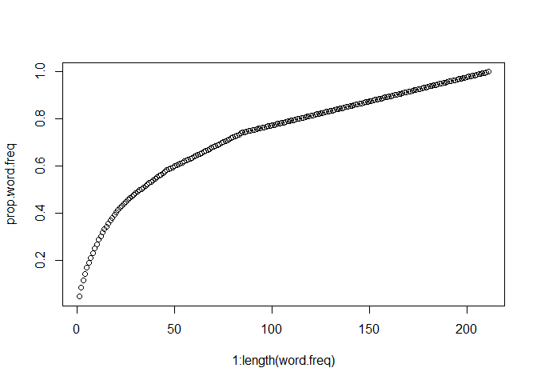
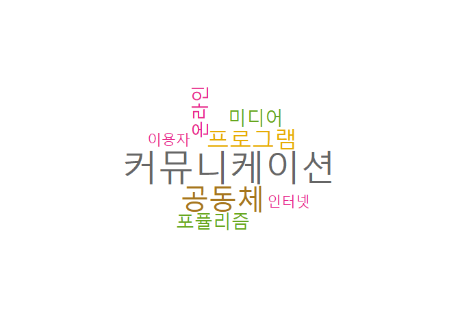

N-Gram
================

``` r
library(KoNLP) # 가장먼지 임포트 해야 에러가 없다. 
library(rJava)
library(stringr)
library(RWeka)
library(tm)
library(dplyr)
```

## n-gram 추출

#### 1-1 Corpus 만들기

``` r
mytext<-c("The United States comprises fifty states.", 
          "In the United States, each state has its own laws.", 
          "However, federal law overrides state law in the United States.")

mytext
```

    ## [1] "The United States comprises fifty states."                     
    ## [2] "In the United States, each state has its own laws."            
    ## [3] "However, federal law overrides state law in the United States."

``` r
mytemp<-VCorpus(VectorSource(mytext)) 
#VCorpus(DirSource("경로")) # 폴더에 있는거 읽어오는 경우
mytemp
```

    ## <<VCorpus>>
    ## Metadata:  corpus specific: 0, document level (indexed): 0
    ## Content:  documents: 3

  - 17\*3 = 51개
  - Non- : 값이 0이 아닌것
  - sparse : 값이 0인것

<!-- end list -->

``` r
mycorpus<-mytemp

extractNoun(mycorpus[[1]]$content)
```

    ## [1] "The"       "United"    "States"    "comprises" "fifty"     "states"

``` r
bigramTokenizer<-function(x) NGramTokenizer(x, Weka_control(min=2, max=2))

a<-TermDocumentMatrix(mycorpus, control=list(tokenize=bigramTokenizer))

b<-extractNoun(a)
```

    ## Warning in preprocessing(sentence_): Input must be legitimate character!
    
    ## Warning in preprocessing(sentence_): Input must be legitimate character!
    
    ## Warning in preprocessing(sentence_): Input must be legitimate character!
    
    ## Warning in preprocessing(sentence_): Input must be legitimate character!
    
    ## Warning in preprocessing(sentence_): Input must be legitimate character!
    
    ## Warning in preprocessing(sentence_): Input must be legitimate character!

``` r
a$dimnames$Terms
```

    ##  [1] "comprises fifty"  "each state"       "federal law"     
    ##  [4] "fifty states"     "has its"          "however federal" 
    ##  [7] "in the"           "its own"          "law in"          
    ## [10] "law overrides"    "overrides state"  "own laws"        
    ## [13] "state has"        "state law"        "states comprises"
    ## [16] "states each"      "the united"       "united states"

#### 1-2 단어를 n개씩으로 묶는다.

``` r
bigramTokenizer<-function(x) NGramTokenizer(x, Weka_control(min=2,max=3))
# 토큰이 2개 또는 3개로 나눠지는 n-gram을 생성한다.


ngram.tdm<-TermDocumentMatrix(mytemp,
                              control=list(tokenize=bigramTokenizer))
#bigram Tokenizer로 토큰화한다. -> 최소2개 최대3개로 나누겠다. 

ngram.tdm
```

    ## <<TermDocumentMatrix (terms: 35, documents: 3)>>
    ## Non-/sparse entries: 43/62
    ## Sparsity           : 59%
    ## Maximal term length: 23
    ## Weighting          : term frequency (tf)

``` r
ngram.tdm$dimnames$Terms
```

    ##  [1] "comprises fifty"         "comprises fifty states" 
    ##  [3] "each state"              "each state has"         
    ##  [5] "federal law"             "federal law overrides"  
    ##  [7] "fifty states"            "has its"                
    ##  [9] "has its own"             "however federal"        
    ## [11] "however federal law"     "in the"                 
    ## [13] "in the united"           "its own"                
    ## [15] "its own laws"            "law in"                 
    ## [17] "law in the"              "law overrides"          
    ## [19] "law overrides state"     "overrides state"        
    ## [21] "overrides state law"     "own laws"               
    ## [23] "state has"               "state has its"          
    ## [25] "state law"               "state law in"           
    ## [27] "states comprises"        "states comprises fifty" 
    ## [29] "states each"             "states each state"      
    ## [31] "the united"              "the united states"      
    ## [33] "united states"           "united states comprises"
    ## [35] "united states each"

2개 3개씩 묶어서 토큰화 할 수도 있다.

#### 전체문서에서 해당 단어가 몇번 등장했는지 알고싶다.

``` r
# 행 단위(2번째 요소 1)로 sum을 하면 전체문서에서 단어의 개수가 나온다.
bigramlist<-apply(ngram.tdm[,], 1, sum) 
sort(bigramlist,decreasing = TRUE)
```

    ##              the united       the united states           united states 
    ##                       3                       3                       3 
    ##                  in the           in the united         comprises fifty 
    ##                       2                       2                       1 
    ##  comprises fifty states              each state          each state has 
    ##                       1                       1                       1 
    ##             federal law   federal law overrides            fifty states 
    ##                       1                       1                       1 
    ##                 has its             has its own         however federal 
    ##                       1                       1                       1 
    ##     however federal law                 its own            its own laws 
    ##                       1                       1                       1 
    ##                  law in              law in the           law overrides 
    ##                       1                       1                       1 
    ##     law overrides state         overrides state     overrides state law 
    ##                       1                       1                       1 
    ##                own laws               state has           state has its 
    ##                       1                       1                       1 
    ##               state law            state law in        states comprises 
    ##                       1                       1                       1 
    ##  states comprises fifty             states each       states each state 
    ##                       1                       1                       1 
    ## united states comprises      united states each 
    ##                       1                       1

#### 한국어 처리

``` r
# library(KoNLP) 
# library(rJava)
# library(stringr)

mytextlocation<-"C:/rwork/Data/papers/논문"
mypaper<-VCorpus(DirSource(mytextlocation))
mypaper[[19]]$content 
mypaper[[19]]$content -> mykorean
```

1.  영어제거
2.  특수문자
    제거

<!-- end list -->

``` r
str_replace_all(mykorean, "[a-z]", "")
str_replace_all(mykorean, "[a-z]", "") -> mytext

str_replace_all(mytext, "\\(", "") -> mytext
str_replace_all(mytext, "\\)", "") -> mytext
str_replace_all(mytext, "·", "") -> mytext
str_replace_all(mytext, "‘", "") -> mytext
str_replace_all(mytext, "’", "") -> mytext
str_replace_all(mytext, ",", "") -> mytext
str_replace_all(mytext, "\\.", "") -> mytext

mytext
```

``` r
str_replace_all(mytext, "[[:punct:]]", "") -> mytext

mytext
```

    ## [1] "본 논문의 목적은 언론학 교육과정 개선논의의 등장배경과 역사를 서술하고 그 필요성과 방향성을 제시하는 것이다 본 논문에서는 컴퓨터 프로그래밍 언어와 데이터 수집  관리  분석  재현과 같은 데이터 과학관련 지식과 기술의 필요성을 강조하며 이를 언론학의 교과과정에 첨가  융합해야 한다는 주장의 등장배경과 필요성을 전반적으로 개괄  소개하였다 또한 제도주의 이론에 근거하여 언론학 교과과정을 제도로 파악하였으며 제도를 둘러싼 이해관계자들로 교수진 학생 학부모를 비롯한 일반인 다른 학문분과들을 논의하였다 이를 통해 기존의 교과과정과 새로운 교과과정이 특정 집단내부 혹은 집단 간 갈등을 일으킬 수 있으며 이러한 갈등을 최소화시키고 협력가능성을 증대시킬 수 있는 방안을 추상적 수준에서나마 제안해 보았다"

``` r
extractNoun(mytext) -> noun.mytext
```

### corpus 모든 문서에서 전처리하기

``` r
mypaper
```

    ## <<VCorpus>>
    ## Metadata:  corpus specific: 0, document level (indexed): 0
    ## Content:  documents: 19

``` r
# 각문서에서 숫자를 추출
lapply(mypaper, function(x) (str_extract_all(x, "[[:digit:]]{1,}"))) -> mydigits
```

    ## argument is not an atomic vector; coercing

``` r
table(unlist(mydigits))
```

    ## 
    ##  080    1   10  120   16   18 1977 1981    2 2000 2001 2004 2006 2010 2013 
    ##    1    5    2    1    1    1    1    1    3    1    2    1    2    1    1 
    ## 2015   21   23   25    3   30  300    4    5    7  863 
    ##    2    1    1    2    2    1    1    1    2    1    1

``` r
# 각문서에서 숫자 없애기
tm_map(mypaper, removeNumbers) -> mycorpus
mycorpus$content
```

    ## [[1]]
    ## <<PlainTextDocument>>
    ## Metadata:  7
    ## Content:  chars: 587
    ## 
    
    ## [[19]]
    ## <<PlainTextDocument>>
    ## Metadata:  7
    ## Content:  chars: 458

``` r
# 각 문서에서 조건에 맞는 Term 추출 
lapply(mypaper, function(x)(str_extract_all(x,"\\b[[:alpha:]]{1,}[[:punct:]]{1,}[[:alpha:]]{1,}\\b")))->mypuncts
```

      
    ## Warning in stri_extract_all_regex(string, pattern, simplify = simplify, :
    ## argument is not an atomic vector; coercing

``` r
table(unlist(mypuncts))
```

    ## 
    ##                account)을           action)이론들을 
    ##                         1                         1 
    ##               Consumer)의          consumption)하는 
    ##                         1                         1 
    ##                 effect)를           Performing-arts 
    ##                         1                         1 
    ##              가치지향’은          감시견’으로서의 
    ##                         2                         1 
    ##              감염자’라는                   경우)의 
    ##                         1                         1 
    ##           관계유지’(기존        관계형성’(SNS에서 
    ##                         1                         1 
    ##       관계회복’(끊어졌던          광고·기업태도를 
    ##                         1                         1 
    ##          광고·기업태도에       교육과정(curriculum 
    ##                         1                         1 
    ##                  국민’을                기업－공익 
    ##                         1                         6 
    ##                  노출’이            대등적－일방적 
    ##                         1                         1 
    ##             대등적-협력적        대리소비(vicarious 
    ##                         1                         1 
    ##                  만족’을                  모형’을 
    ##                         3                         1 
    ##                문화’에는       문화소비자들(Active 
    ##                         3                         1 
    ##              민주주의’의               변명(excuse 
    ##                         1                         1 
    ##               부인(denial        사회요망성가설’들 
    ##                         1                         1 
    ##      사회인지이론(Bandura      설득과정모형(McGuire 
    ##                         1                         1 
    ##              성별·연령별            성별·연령별로 
    ##                         1                         1 
    ##    소통행위(communicative         양가감정(兩價感情 
    ##                         1                         1 
    ##                   없음(no                엘리트’와 
    ##                         1                         1 
    ##               온/오프라인            유지·형성하는 
    ##                         1                         1 
    ##              이념성향’도            이론적·실제적 
    ##                         1                         1 
    ##              이방인’들을            인사청문회’를 
    ##                         1                         1 
    ##                 인식’)를             일방적-상호적 
    ##                         1                         1 
    ##              저널리즘’과                  전략’을 
    ##                         1                         1 
    ##      정당화(justification                정당화’와 
    ##                         1                         1 
    ##              정치·경제적              정치신뢰’를 
    ##                         1                         1 
    ##            정치적·사회적          제도(institution 
    ##                         1                         1 
    ## 제도주의(institutionalism             주재국-대사관 
    ##                         1                         1 
    ##                직접·간접           직접효과(direct 
    ##                         1                         1 
    ##                 진보-보수                  참여’를 
    ##                         1                         1 
    ##           참회(confession                 창조-매개 
    ##                         1                         1 
    ##          추정오류가설’이                    타입-I 
    ##                         1                         1 
    ##             평가(‘자신의            학문분과들’을 
    ##                         1                         1 
    ##          허위합의지각’을            협력적－상호적 
    ##                         1                         1 
    ##            협력적－일방적 
    ##                         1

``` r
# 각 문서에서 extract all
mytempfunct<-function(myobject, oldexp, newexp) {
  tm_map(myobject, content_transformer(function(x, pattern) gsub(pattern, newexp, x)), oldexp)
}


mycorpus<-mytempfunct(mycorpus, "[[:lower:]]{1,}", "")
mycorpus
```

    ## <<VCorpus>>
    ## Metadata:  corpus specific: 0, document level (indexed): 0
    ## Content:  documents: 19

``` r
mycorpus[[1]]
```

    ## <<PlainTextDocument>>
    ## Metadata:  7
    ## Content:  chars: 587

``` r
length(mycorpus)
```

    ## [1] 19

``` r
#str_replace_all(mycorpus[[i]]$content, "[[:lower:]]{1,}", "")

for (i in (1:length(mycorpus))){
  mycorpus[[i]]$content <- str_replace_all(mycorpus[[i]]$content, "[A-Za-z]", "")
  str_replace_all(mycorpus[[i]]$content, "\\(", "") -> mycorpus[[i]]$content
  str_replace_all(mycorpus[[i]]$content, "\\)", "") -> mycorpus[[i]]$content
  str_replace_all(mycorpus[[i]]$content, "·", "") -> mycorpus[[i]]$content
  str_replace_all(mycorpus[[i]]$content, "‘", "") -> mycorpus[[i]]$content
  str_replace_all(mycorpus[[i]]$content, "’", "") -> mycorpus[[i]]$content
  str_replace_all(mycorpus[[i]]$content, ",", "") -> mycorpus[[i]]$content
  str_replace_all(mycorpus[[i]]$content, "\\.", "") -> mycorpus[[i]]$content
}

mycorpus[[6]]$content
```

    ## [1] "이 연구는 정치인의 말하기 방식에 따라 해당정치인에 대한 개인적 도덕성 평가는 물론 정치전반에 대한 신뢰와 냉소주의에 미치는 영향을 가상적 인사청문회 상황을 이용한 실험연구를 통해 살펴보았다 선행연구에 기반하여 의혹에 싸인 정치인이 채택할 수 있는 정치적 말하기 방식을  부인  정당화  변명  참회로 구분한 후 각각의 해명효과를 살펴보기 위해서 의혹만 제기되고 해명은 제기되지 않는  해명 없음 을 추가한 가지의 실험조건을 준비하였다 정치적 의혹이 제기되고 해명되는 정치적 상황으로는 고위공직자 인사청문회를 선택하였다 실험결과 정당화와 참회 전략에서 해당정치인에 대해 상대적으로 높은 도덕적 평가가 나타났다 정치전반에 대한 신뢰의 경우 오직 참회 전략만이 국민들의 정치신뢰를 고양시킬 수 있는 것으로 나타났다 이 연구는 정치인의 말하기 방식이 개별정치인의 평판관리 전략을 넘어서 좋은 민주주의의 조건 중 하나인 정치신뢰를 낳을 수도 있다는 것을 보여주고 있다"

``` r
myNounFun<-function(mytext){
  myNounList<-paste(extractNoun(mytext), collapse = " ")
  return(myNounList)
}

print(myNounFun(mycorpus[[3]]$content)->myNounList)
```

    ## [1] "지상파 방송사 조직 문화 기존연구 방송사 내부 이질적 배타 적 하위문화 들 존재 상호작용 주목 하지 논문 자율성 선호도 부 내 응집 도라 두 축 가지 하위문화 유형 구분 한 후 방송 사내 부서 들이 이중 유형 이 공공성 상업성 중 방향 가치지향 성 분석 연구 결과 자율성 응집 도 공동체적 합의 문화 유형 기술 영상미 술 부서 들 자율성 응집 도 낮 개별화 네트워크 문화 라디오 사교 양 부 것 반면 부 자율성 조직 전체 목교 추구 중시하 부 내 응집 도 가부장적 문화 보도 기획 편성 부서 들 전체 조직 목표 추구 중시하 부 내 응집 도 낮 문화 인력자원 부 것 확인 되 가치지향 성 관련 해 부 자율성 중시 방송사 추구 할 목표 공익성 인식하 반면 전체 조직 목표 중시 상업성 방향 확인되었"

``` r
mycorpus[[3]]$content
```

    ## [1] "지상파 방송사 조직문화에 대한 기존연구들은 방송사 내부의 이질적이고 상호 배타적인 하위문화들의 존재와 그 상호작용에 주목하지 못하고 있다 본 논문에서는 자율성 선호도와 부서 내 응집도라는 두 축에 따라 네 가지 하위문화 유형을 구분한 후 방송사내 부서들이 이중 어느 유형에 속하며 이에 따라 공공성과 상업성 중 어느 방향의 가치지향성을 갖는지 분석하였다 연구결과 자율성과 응집도가 모두 높은 공동체적 합의문화 유형에는 기술과 영상미술 부서들 자율성은 높지만 응집도가 낮은 개별화된 네트워크 문화에는 라디오와 시사교양 부서가 속하는 것으로 드러났다 반면 부서의 자율성보다 조직 전체의 목교 추구를 중시하며 부서 내 응집도가 높은 가부장적 문화에는 보도 기획 편성 부서들 전체 조직의 목표 추구를 중시하지만 부서 내 응집도가 낮은 관료제적 문화에는 인력자원 부서가 속하는 것으로 확인되었다 가치지향성과 관련해 부서의 자율성을 중시할수록 방송사가 추구할 목표를 공익성으로 인식하는 반면 전체 조직 목표를 중시할수록 상업성 방향으로 기울어 있음이 확인되었다"

### corpus에서 명사 추출하기

``` r
length(mycorpus)
```

    ## [1] 19

``` r
myNounCorpus<-mycorpus

# corpus에 있는 문서 개수만큼 반복하며 새로운 변수에 명사 저장
for(i in 1:length(mycorpus)){
  myNounCorpus[[i]]$content<-
    myNounFun(mycorpus[[i]]$content)
}
myNounCorpus[[19]]$content
```

    ## [1] "논문 목적 언론학 교육 과정 개선 논의 등장 배경 역사 서술 필요 성 방향 성 제시 하 것 논문 컴퓨터 프로그래밍 언어 데이터 수집 관리 분석 재현 데이터 과학 관련 지식 기술 필요 성 강조 이 언론학 교과과정 첨 융합 주장 등장 배경 필요 성 전반적 개괄 소개 제도 주의 이론 근거 하 언론학 교과과정 제도 파악 제도 이해관계자 들 교수진 학생 학부모 비롯 한 일반 학문분과 들 논의 이 기존 교과과정 교과과정 특정 집단 내부 집단 갈등 수 갈등 최소 화시 키 협력가능성 증대 수 방안 수준 제안 해 보았"

``` r
# 모든 문서의 명사 빈도수
#table(unlist(lapply(myNounCorpus, function(x) str_extract_all(x,boundary("word")))))

imsi<-myNounCorpus

# 모든 문서에서 특정 문자열 replace 하기
for(i in 1:length(myNounCorpus)){
  myNounCorpus[[i]]$content<-str_replace_all(imsi[[i]]$content, "커뮤니[[:alpha:]]{1,}", "커뮤니케이션")
}

# DTM 만들기
print(DocumentTermMatrix(myNounCorpus)->dtm.k)
```

    ## <<DocumentTermMatrix (documents: 19, terms: 211)>>
    ## Non-/sparse entries: 266/3743
    ## Sparsity           : 93%
    ## Maximal term length: 8
    ## Weighting          : term frequency (tf)

``` r
#colnames(dtm.k)

# 위키리크스를 -> 위키리크스

for(i in 1:length(myNounCorpus)){
  imsi[[i]]$content<-str_replace_all(imsi[[i]]$content, "(위키리크스)[[:alpha:]]{1,}", "위키리크스")
}

#colnames(DocumentTermMatrix(imsi))
```

### 기술통계분석

``` r
#빈도수 합계
apply(dtm.k[,],2,sum)->word.freq

head(word.freq)
```

    ##   가능성 가부장적 가설검증   가중치   가치관 가치지향 
    ##        1        1        1        2        1        6

``` r
length(word.freq)
```

    ## [1] 211

``` r
# 내림차순 정렬
sort(word.freq, decreasing = T) -> sort.word.freq
sort.word.freq[1:20]
```

    ## 커뮤니케이션       공동체     프로그램       미디어     포퓰리즘 
    ##           23           19           15           13           13 
    ##       온라인       이용자       인터넷     오프라인     정책연구 
    ##           11           10           10            9            9 
    ##       효능감       시청자     이념성향       트위터     가치지향 
    ##            9            8            7            7            6 
    ##     건강증진       관계망       데이터     상호작용     여론조사 
    ##            6            6            6            6            5

``` r
# 누계 합 -> 상위 20개까지의 단어등장 횟수
cumsum.word.freq<-cumsum(sort.word.freq)
cumsum.word.freq[1:20]
```

    ## 커뮤니케이션       공동체     프로그램       미디어     포퓰리즘 
    ##           23           42           57           70           83 
    ##       온라인       이용자       인터넷     오프라인     정책연구 
    ##           94          104          114          123          132 
    ##       효능감       시청자     이념성향       트위터     가치지향 
    ##          141          149          156          163          169 
    ##     건강증진       관계망       데이터     상호작용     여론조사 
    ##          175          181          187          193          198

``` r
# 각 단어 등장횟수 / 총 단어 등장횟수
prop.word.freq<-cumsum.word.freq/cumsum.word.freq[length(cumsum.word.freq)]
prop.word.freq
```

    ##     커뮤니케이션           공동체         프로그램           미디어 
    ##       0.04693878       0.08571429       0.11632653       0.14285714 
    ##         포퓰리즘           온라인           이용자           인터넷 
    ##       0.16938776       0.19183673       0.21224490       0.23265306 
    ##         오프라인         정책연구           효능감           시청자 
    ##       0.25102041       0.26938776       0.28775510       0.30408163 
    ##         이념성향           트위터         가치지향         건강증진 
    ##       0.31836735       0.33265306       0.34489796       0.35714286 
    ##           관계망           데이터         상호작용         여론조사 
    ##       0.36938776       0.38163265       0.39387755       0.40408163 
    ##           자율성           한국의         교과과정         논의하였 
    ##       0.41428571       0.42448980       0.43265306       0.44081633 
    ##           외교전           정치인         조사방법           컴퓨터 
    ##       0.44897959       0.45714286       0.46530612       0.47346939 
    ##         과도응답           긍정적           동기와           말하기 
    ##       0.47959184       0.48571429       0.49183673       0.49795918 
    ##           메르스         민주주의           방송사         설문조사 
    ##       0.50408163       0.51020408       0.51632653       0.52244898 
    ##           소비자           언론학           유의미           응답자 
    ##       0.52857143       0.53469388       0.54081633       0.54693878 
    ##         인간관계         정권교체           주재국           중시하 
    ##       0.55306122       0.55918367       0.56530612       0.57142857 
    ##           탈규범           행복감           가중치           감염자 
    ##       0.57755102       0.58367347       0.58775510       0.59183673 
    ##           규정하         네트워크         대형병원           동질성 
    ##       0.59591837       0.60000000       0.60408163       0.60816327 
    ##           리더쉽           마케팅         문화예술       미국대사관 
    ##       0.61224490       0.61632653       0.62040816       0.62448980 
    ##           방법론           방정식       보수주의자         비이용자 
    ##       0.62857143       0.63265306       0.63673469       0.64081633 
    ##           상업성           상호적           서베이         선행연구 
    ##       0.64489796       0.64897959       0.65306122       0.65714286 
    ##           신뢰도           신문사           양극화           어려움 
    ##       0.66122449       0.66530612       0.66938776       0.67346939 
    ##           연령별         인터넷을           잘못된           전문가 
    ##       0.67755102       0.68163265       0.68571429       0.68979592 
    ##           정당화           정치전           주관적           중립적 
    ##       0.69387755       0.69795918       0.70204082       0.70612245 
    ##           참가자           청문회           타당성           텍스트 
    ##       0.71020408       0.71428571       0.71836735       0.72244898 
    ##         표본조사       표집방법에         하위문화       할당표집한 
    ##       0.72653061       0.73061224       0.73469388       0.73877551 
    ##       해당정치인           가능성         가부장적         가설검증 
    ##       0.74285714       0.74489796       0.74693878       0.74897959 
    ##           가치관           감시견           개별적           개별화 
    ##       0.75102041       0.75306122       0.75510204       0.75714286 
    ##         개선방안         건강정보         검증하였           고양시 
    ##       0.75918367       0.76122449       0.76326531       0.76530612 
    ##       고위공직자           공공성         공동육아         공동체적 
    ##       0.76734694       0.76938776       0.77142857       0.77346939 
    ##         공연예술           공익성 관계회복끊어졌던           관행적 
    ##       0.77551020       0.77755102       0.77959184       0.78163265 
    ##           교수진           국내외         권위주의         귀인이론 
    ##       0.78367347       0.78571429       0.78775510       0.78979592 
    ##           기고자         기존연구           나타났         남북경협 
    ##       0.79183673       0.79387755       0.79591837       0.79795918 
    ##         냉소주의       노스탤지어           대사관           대상자 
    ##       0.80000000       0.80204082       0.80408163       0.80612245 
    ##           대외비           대용량       도시공동체           동북아 
    ##       0.80816327       0.81020408       0.81224490       0.81428571 
    ##     디리쉴레분포           라디오         兩價感情           레토릭 
    ##       0.81632653       0.81836735       0.82040816       0.82244898 
    ##           만족감         매개과정         매개변수         발견하였 
    ##       0.82448980       0.82653061       0.82857143       0.83061224 
    ##       보수ㆍ진보           본국인           불일치         비실용성 
    ##       0.83265306       0.83469388       0.83673469       0.83877551 
    ##           사람들           사회학           서울시         서울시민 
    ##       0.84081633       0.84285714       0.84489796       0.84693878 
    ##           선호도         소개하였           식도락           신도시 
    ##       0.84897959       0.85102041       0.85306122       0.85510204 
    ##           신뢰성           실제적         실천이론         실험결과 
    ##       0.85714286       0.85918367       0.86122449       0.86326531 
    ##         실험연구         실험조건           양진영           엘리트 
    ##       0.86530612       0.86734694       0.86938776       0.87142857 
    ##           역사학           연구자           영상미           예술계 
    ##       0.87346939       0.87551020       0.87755102       0.87959184 
    ##       위키리크스     위키리크스를   위키리크스에서   유지ㆍ형성하는 
    ##       0.88163265       0.88367347       0.88571429       0.88775510 
    ##           유형별           융합적           이론과           이론적 
    ##       0.88979592       0.89183673       0.89387755       0.89591837 
    ##           이방인       이야깃거리     이어지는가를         이용행태 
    ##       0.89795918       0.90000000       0.90204082       0.90408163 
    ##           이질적       이해관계자         인력자원           인식하 
    ##       0.90612245       0.90816327       0.91020408       0.91224490 
    ##         인지이론           인터뷰           일방적         있는가에 
    ##       0.91428571       0.91632653       0.91836735       0.92040816 
    ##           잠재력           재검토           재구성         저널리즘 
    ##       0.92244898       0.92448980       0.92653061       0.92857143 
    ##         적용사례           전반적           정반대           정치적 
    ##       0.93061224       0.93265306       0.93469388       0.93673469 
    ##           정치학         제시하였           조직적           주도하 
    ##       0.93877551       0.94081633       0.94285714       0.94489796 
    ##           주성분         주한미군       중도주의자           지상파 
    ##       0.94693878       0.94897959       0.95102041       0.95306122 
    ##           지속적       지역공동체         직접간접   직ㆍ간접적으로 
    ##       0.95510204       0.95714286       0.95918367       0.96122449 
    ##       진보주의자           집단별           참여자         책임소재 
    ##       0.96326531       0.96530612       0.96734694       0.96938776 
    ##         텔레비전         통계학적       프로그래밍         하는가에 
    ##       0.97142857       0.97346939       0.97551020       0.97755102 
    ##         학문분과           학부모         학술연구           한계점 
    ##       0.97959184       0.98163265       0.98367347       0.98571429 
    ##         한미통상         해외파병       협력가능성           협력적 
    ##       0.98775510       0.98979592       0.99183673       0.99387755 
    ##         확인되었         환경보호           활성화 
    ##       0.99591837       0.99795918       1.00000000

``` r
plot(1:length(word.freq),prop.word.freq)
```

<!-- -->

``` r
# wordcloud
library(wordcloud)
```

    ## Loading required package: RColorBrewer

``` r
library(RColorBrewer)
mypal = brewer.pal(8, "Dark2")
word.freq
```

    ##           가능성         가부장적         가설검증           가중치 
    ##                1                1                1                2 
    ##           가치관         가치지향           감시견           감염자 
    ##                1                6                1                2 
    ##           개별적           개별화         개선방안         건강정보 
    ##                1                1                1                1 
    ##         건강증진         검증하였           고양시       고위공직자 
    ##                6                1                1                1 
    ##           공공성         공동육아           공동체         공동체적 
    ##                1                1               19                1 
    ##         공연예술           공익성         과도응답           관계망 
    ##                1                1                3                6 
    ## 관계회복끊어졌던           관행적         교과과정           교수진 
    ##                1                1                4                1 
    ##           국내외         권위주의         귀인이론           규정하 
    ##                1                1                1                2 
    ##           긍정적           기고자         기존연구           나타났 
    ##                3                1                1                1 
    ##         남북경협         냉소주의         네트워크       노스탤지어 
    ##                1                1                2                1 
    ##         논의하였           대사관           대상자           대외비 
    ##                4                1                1                1 
    ##           대용량         대형병원           데이터       도시공동체 
    ##                1                2                6                1 
    ##           동기와           동북아           동질성     디리쉴레분포 
    ##                3                1                2                1 
    ##           라디오         兩價感情           레토릭           리더쉽 
    ##                1                1                1                2 
    ##           마케팅           만족감           말하기         매개과정 
    ##                2                1                3                1 
    ##         매개변수           메르스         문화예술       미국대사관 
    ##                1                3                2                2 
    ##           미디어         민주주의         발견하였           방법론 
    ##               13                3                1                2 
    ##           방송사           방정식       보수주의자       보수ㆍ진보 
    ##                3                2                2                1 
    ##           본국인           불일치         비실용성         비이용자 
    ##                1                1                1                2 
    ##           사람들           사회학           상업성         상호작용 
    ##                1                1                2                6 
    ##           상호적           서베이           서울시         서울시민 
    ##                2                2                1                1 
    ##         선행연구           선호도         설문조사         소개하였 
    ##                2                1                3                1 
    ##           소비자           시청자           식도락           신도시 
    ##                3                8                1                1 
    ##           신뢰도           신뢰성           신문사           실제적 
    ##                2                1                2                1 
    ##         실천이론         실험결과         실험연구         실험조건 
    ##                1                1                1                1 
    ##           양극화           양진영           어려움           언론학 
    ##                2                1                2                3 
    ##           엘리트         여론조사           역사학           연구자 
    ##                1                5                1                1 
    ##           연령별           영상미           예술계         오프라인 
    ##                2                1                1                9 
    ##           온라인           외교전       위키리크스     위키리크스를 
    ##               11                4                1                1 
    ##   위키리크스에서           유의미   유지ㆍ형성하는           유형별 
    ##                1                3                1                1 
    ##           융합적           응답자         이념성향           이론과 
    ##                1                3                7                1 
    ##           이론적           이방인       이야깃거리     이어지는가를 
    ##                1                1                1                1 
    ##           이용자         이용행태           이질적       이해관계자 
    ##               10                1                1                1 
    ##         인간관계         인력자원           인식하         인지이론 
    ##                3                1                1                1 
    ##           인터넷         인터넷을           인터뷰           일방적 
    ##               10                2                1                1 
    ##         있는가에           자율성           잘못된           잠재력 
    ##                1                5                2                1 
    ##           재검토           재구성         저널리즘         적용사례 
    ##                1                1                1                1 
    ##           전문가           전반적         정권교체           정당화 
    ##                2                1                3                2 
    ##           정반대         정책연구           정치인           정치적 
    ##                1                9                4                1 
    ##           정치전           정치학         제시하였         조사방법 
    ##                2                1                1                4 
    ##           조직적           주관적           주도하           주성분 
    ##                1                2                1                1 
    ##           주재국         주한미군       중도주의자           중립적 
    ##                3                1                1                2 
    ##           중시하           지상파           지속적       지역공동체 
    ##                3                1                1                1 
    ##         직접간접   직ㆍ간접적으로       진보주의자           집단별 
    ##                1                1                1                1 
    ##           참가자           참여자         책임소재           청문회 
    ##                2                1                1                2 
    ##     커뮤니케이션           컴퓨터           타당성           탈규범 
    ##               23                4                2                3 
    ##           텍스트         텔레비전         통계학적           트위터 
    ##                2                1                1                7 
    ##         포퓰리즘         표본조사       표집방법에       프로그래밍 
    ##               13                2                2                1 
    ##         프로그램         하는가에         하위문화         학문분과 
    ##               15                1                2                1 
    ##           학부모         학술연구           한계점           한국의 
    ##                1                1                1                5 
    ##         한미통상       할당표집한       해당정치인         해외파병 
    ##                1                2                2                1 
    ##           행복감       협력가능성           협력적         확인되었 
    ##                3                1                1                1 
    ##         환경보호           활성화           효능감 
    ##                1                1                9

``` r
wordcloud(names(word.freq),
          freq = word.freq,
          min.freq = 10
          ,col=mypal, 
          random.order = F, 
          scale=c(4,0,2))
```

<!-- -->
